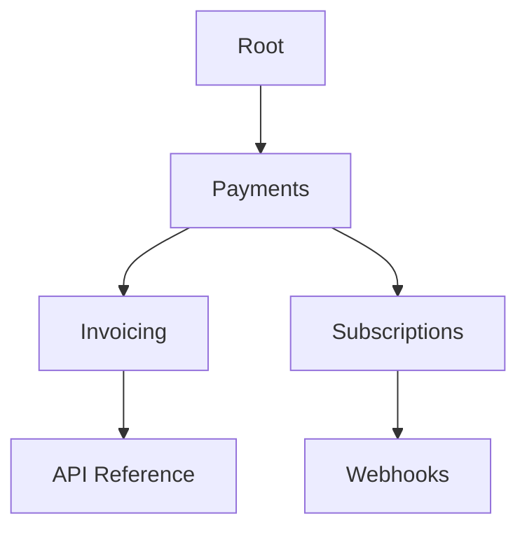

## Overview

Paperguide-pay provides powerful features to help you organize, collaborate on, and share your payment documentation efficiently. You can structure complex docs with nested hierarchies, enable team collaboration with version history, search across content using tags, and export in multiple formats.

1. this is new

   1. sas

   2. as

2. asdas

3. asdas\


<Columns cols="2">
  <Card title="Structured Docs" href="#document-structuring" icon="book-open" horizontal="false">
    Build nested hierarchies for clear navigation.
  </Card>

  <Card title="Team Collaboration" href="#collaboration" icon="users" horizontal="false">
    Work together with real-time edits and version control.
  </Card>

  <Card title="Advanced Search" href="#search-tagging" icon="search" horizontal="false">
    Find content quickly with tags and full-text search.
  </Card>

  <Card title="Export Options" href="#export-sharing" icon="download" horizontal="false">
    Share docs via PDF, HTML, or public links.
  </Card>
</Columns>

## Document Structuring and Hierarchy

You create intuitive document structures using folders, pages, and subpages. This hierarchy ensures users navigate payment guides effortlessly, from high-level overviews to detailed API references.

<Steps>
  <Step title="Create Folders" icon="folder" title-type="p">
    In the dashboard, click **New Folder** to group related payment docs.
  </Step>

  <Step title="Add Pages" icon="file-text" title-type="p">
    Inside folders, add pages for topics like `{invoicing}` or `{subscriptions}`.
  </Step>

  <Step title="Nest Subpages" icon="chevron-down" title-type="p">
    Drag pages to create sublevels, up to five deep.
  </Step>
</Steps>


```mermaid
graph TD
    A[Root] --> B[Payments]
    B --> C[Invoicing]
    C --> D[API Reference]
    B --> E[Subscriptions]
    E --> F[Webhooks]
```

<Callout kind="tip" collapsed="false">
  Use frontmatter in pages to set custom `{title}` and `{description}` for better SEO.
</Callout>

## Collaboration and Version Control

Invite team members to co-edit docs in real-time. Paperguide-pay tracks every change with version history, so you revert mistakes or review payment policy updates.

<Tabs>
  <Tab title="Invite Collaborators" icon="user-plus">
    Go to **Team Settings** > **Invite Member**. Share read/write access for `{editor}` roles.
  </Tab>

  <Tab title="Version History" icon="git-branch">
    Click **History** on any page to view diffs and restore versions.
  </Tab>
</Tabs>

<CodeGroup show-lines="true" tabs={[]}>
  ```bash
  paperguide invite --email team@company.com --role editor
  ```

  ```javascript
  await paperguide.authenticatedRequest('/teams/invite', {
    method: 'POST',
    body: { email: 'team@company.com', role: 'editor' }
  });
  ```
</CodeGroup>

## Search and Tagging Functionalities

Tag pages with labels like `{stripe}`, `{paypal}`, or `{recurring}` for precise searches. Full-text search scans titles, content, and tags across your entire workspace.

| Feature          | Description                  | Example Tags                |
| ---------------- | ---------------------------- | --------------------------- |
| Full-Text Search | Matches keywords in content  | `invoicing`, `refunds`      |
| Tag Filtering    | Narrow by custom labels      | `{webhook}`, `{pci}`        |
| Advanced Filters | Combine date, author, status | `status:draft author:alice` |

<Callout kind="info" collapsed="false">
  Tags support up to 50 characters and special chars like `{}` for grouping.
</Callout>

## Export and Sharing Options

Export docs as PDF for compliance audits or share public links for client portals. You control access with passwords or expiration dates.

<ExpandableGroup>
  <Expandable title="PDF Export" default-open="true">
    Select pages > **Export > PDF**. Includes hierarchy and images.
  </Expandable>

  <Expandable title="Public Sharing" default-open="false">
    Publish pages > Copy `{share-link}`. Set viewer permissions.
  </Expandable>

  <Expandable title="HTML Archive" default-open="false">
    Export entire workspace as a static site for offline use.
  </Expandable>
</ExpandableGroup>

<Columns cols="2">
  <Card title="Quickstart" href="/quickstart" icon="rocket" horizontal="false">
    Set up your first workspace.
  </Card>

  <Card title="Authentication" href="/authentication" icon="shield" horizontal="false">
    Secure your payment docs.
  </Card>
</Columns>

